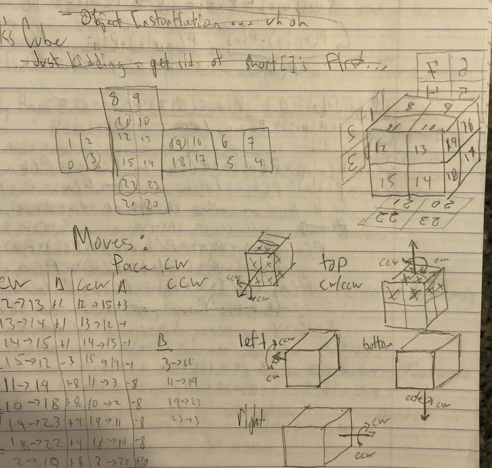

## Rubiks Cube

### Representing The GameState

Representing the Rubik's cube is significantly less intuitive than representing the 8-puzzle. Similarly to the 8-puzzle, a `short[]` is used to store the state. There are 6*4=24 tiles/pieces, so the array is size 24. The values of the pieces are the integers from 0 to 23. Therefore, the initial state, like the 8-puzzle, is when each piece is equal to its index. The following diagram illustrates how the array translates to the cube:

In terms of coloring, one could arbitrarily assign color values to a range of 4 consecutive integers. For example, 0-3 could be yellow, 4-7 could be blue, and so on. When making moves, the move function is more or less hardcoded to move the pieces accordingly depending on the face being rotated. See `move(Move move)` function in `RubiksPuzzleState.java` for the table. There may be a way to generalize this, but I could not think of a way to do so. 

When printing out the state, or setting the state with `setState`, the game solver uses "Triacontakaidecimal" numbering, which is essentially just extended hexadecimal numbering. So, the goal state is: `0123 4567 89ab cdef ghij klmn`.

### Modifications to Gameplay Interface

A new command `play` has been added: 

`play rubiks` initializes a Rubik's Cube.

`play 8-puzzle` initializes an 8-puzzle.

### Heuristics

#### h1 

The first heuristic that I implemented was effectively the same as h1 for the 8-puzzle: the number of misplaced of 'tiles'. This is a poor heuristic; it is not addmissible. Consider starting at the goal state and making 1 move. If the heuristic is admissible, it will return less than or equal to 1. However, one move from the goal state displaces 12 tiles. So, the heuristic returns 12 when the goal state is just 1 move away.  

#### future heuristics

I am not familiar with techniques used to solve 2x2 cubes, but I have a little bit of experience with 3x3 cubes. Typically, it is possible to move a single tile from one location to another, with at least one face unchanged, through a fixed sequence of moves. Perhaps it would be possible to write a heuristic to detect when a given state exists such that it is feasible to apply some fixed sequence with the result being a known better state. 

Another idea would be to implement subgoals. When the cube is in a known state (e.g. one face is the correct color), some predetermined value is returned by the heuristic function. I do not know if this is still considered a heuristic, but it would at least provide the search algorithm with some idea of when a state is "good" or not. 

### Results

Due to the woefully ineffective heuristic, both A* and Beam search are not very good at solving the puzzle. 

#### A-star search

A* with h1 is not terribly effective. A-star can only solve puzzles with 2 random moves. 

#### Beam search

Beam search with h1 can only solve puzzles with 3 random moves. I tried to run beam on the state with 4 random moves but the program crashed after hitting the "garbage collection overhead limit." 

In both cases, the bad heuristic makes it so that once the cube is randomized beyond 2/3 moves, the solver is essentially just randomizing the cube further. It is not heading in the right direction at all. 

#### Code Reuse

In order to accomodate the Rubik's Cube, only minor changes were made to the GameSolver class. Primarily, this involved fixing the GameState interface, then swapping that in for NPuzzleState. The rest of the changes were made to make sure that GameSolver would be able to act on general GameState objects. There were no changes made to the actual game-solving algorithms. 

Several other changes were made to the Main class in order to accomodate the ability to play either game from the same Main class.

## TODO

* refactor into GameSolver/abstract GameState class:
	* randomizeState and makeRandomMove
	* printPath
	* overridden methods (equals, hashCode)
* implement another (better) heuristic
* come up with a better string representation of the 2x2x2 cube
* the file parsing interface needs to know about RubiksPuzzle
* stringToMove methods should throw exceptions instead of returning null
* why bother with string lowercase when enums are caps?